# 基础工具

> 工欲善其事，必先利其器。  
大部分情况下，好的工具是起着辅助的作用。即使缺少了好工具也只是降低了开发效率，比如选择记事本也可以写出优秀的代码。  
但是，我们都是「懒」且聪明的开发者，我们善于使用优秀的工具，让工具解放劳动力，加大生产力，提高开发效率。  
这里介绍几个前端基本的且广为使用的相关工具：  
Git 代码管理、Chrome dev tools、编辑器与 IDE、PS 与 Sketch 切图、Charles 网路代理。

## 代码调试：dev tools

在 N 年前，有款工具叫 Firebug，那时他还很流行。  
2005 年 Firebug 面世，是 Firefox 中首个可以让 Web 开发者检测「inspect」、编辑「edit」、调试「debug」的工具。  
在后续的 Firefox Quantum 发布中，Firebug 所有功能已经集成在 Firefox DevTools。

在 2008 年 9 月，Chrome 发布第一版。后来 Chrome dev tools 慢慢占了上风。  
Firebug 相比 Chrome dev tools 有很多不足，比如：不支持拖拽 DOM、不支持修改修改 user-agent、界面不友好……  
接下来聊聊 Chrome dev tools，以下简称 devTools「以 Chrome for Mac 67 版本为标准」。

- 初识 devTools

打开 devTools 界面「快捷键：cmd + ait + I 或者 cmd + shift + C」，看到基本的操作界面，由功能导航栏、功能面板组成。  
导航栏，主要展示 devTools 主要功能，以及功能切换。最常用的功能面板有：Elements、Console、Network。  
功能面则是当前使用功能的操作面板。  

- 查找元素、修改样式、事件追踪

首先选择 Element 面板，快捷键「cmd + shift + C」进入选择元素模式，或者点击界面左上角的「元素选择图标」。  

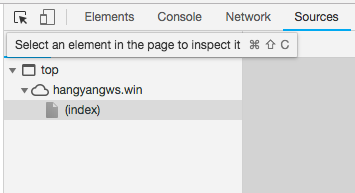

鼠标移动到相应的元素上，相应的元素盒子模型会有相应的颜色高亮，用来表示当前选择到的元素的「轮廓」。   

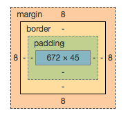

选择好对应的元素后，在操作面板会出现 2 个子面板：元素面板、样式面板。  
并且在元素面板中高亮当前选择的元素，样式面板中展示对应样式和盒子模型。  
在元素面板中右键元素，会展开很多操作选项，比如复制、删除、编辑节点等选项。  
在样式面板可以查看、编辑样式，还能查看当前样式所在的 CSS 文件与对应的行数。

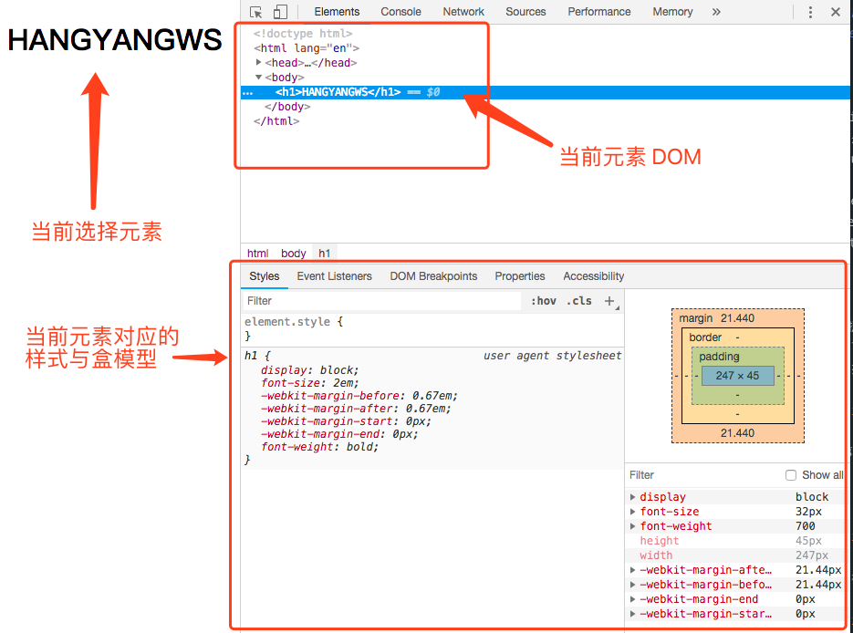

在元素样式面板中有「Event Listeners」的一个选项，可以查看当前元素的事件绑定情况，以及对应的 JS 文件、代码。

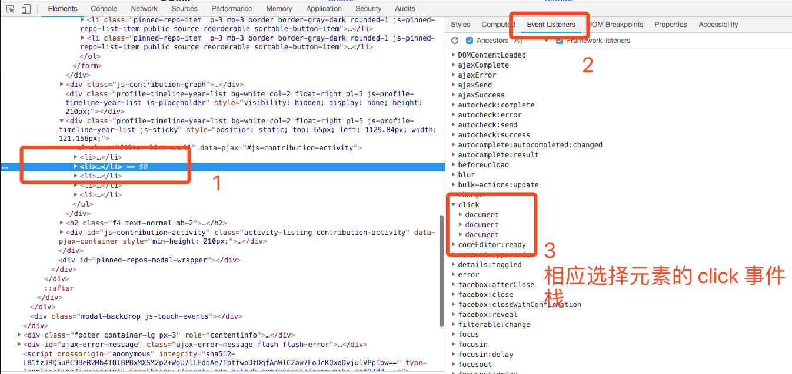

- 模拟页面 UserAgent

如果我们需要写 H5 页面，但是又需要模拟手机分辨率的情况，devTools 的 device toolbar 就很有用了。  
快捷键「cmd + shift + M」或者点击左上角第二个图标，进入 device 调整界面。  

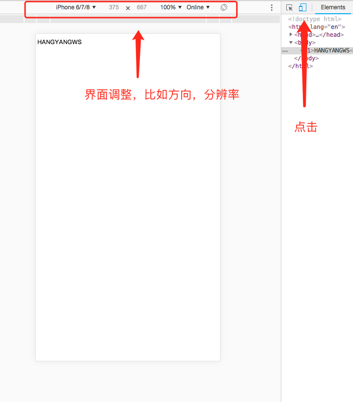

- 查看页面 http 请求

选择 NetWork 面板，可以查看页面所有的 http 请求，且支持搜索、分类查询、查看 http 请求详情等功能。  

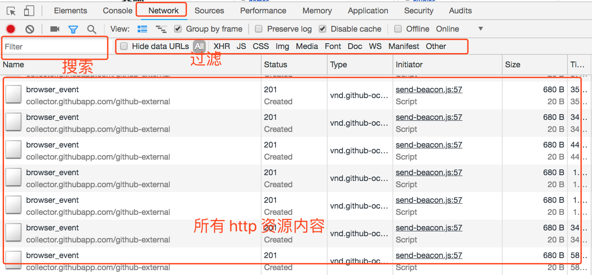
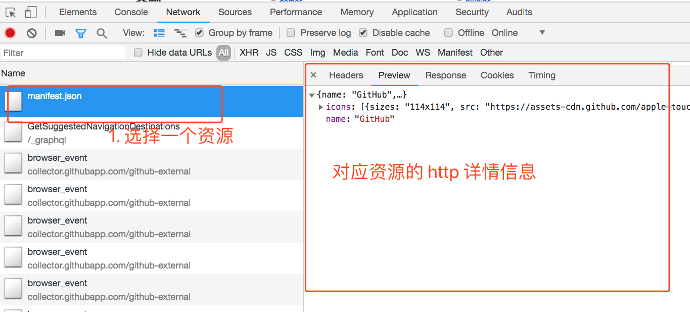

- JS 断点

选择 Sources 面板 → 在左边的资源选择区域选中需要断点的 JS 文件 → 在文件左边的行数提示上点击 → 就完成了一次断点操作。  

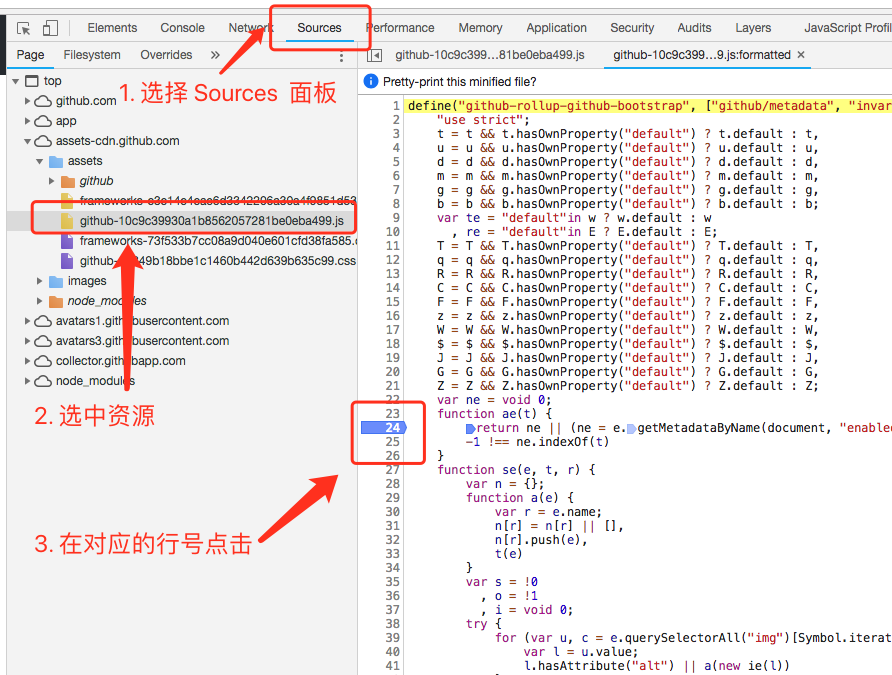

在开发中，在文件中输入「debugger;」，JS 运行时候会自动在此行断点。  
在 Sources 面板中，除了可以行断点，还能 XHR 断点。

关于断点，推荐一篇文章：[Chrome DevTools — JS调试](https://segmentfault.com/a/1190000008396389)  
文章中介绍了 Elements 面板的 DOM 断点、以及 XHR 断点等详细操作。

- 混淆文件格式化

在 Sources 面板中，混淆文件支持一键格式化。

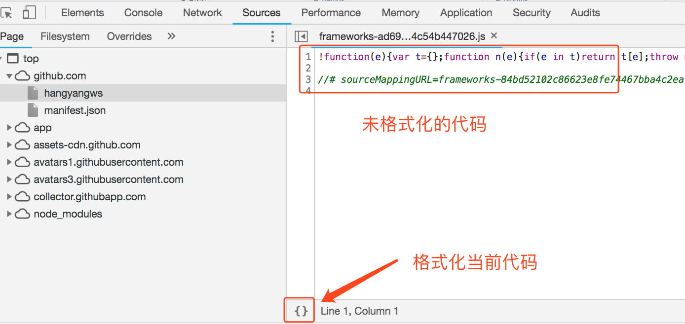

- 查看分析页面性能

我们想知道 FPS、CPU、NET 的使用情况；想知道 JS 代码的执行效率；页面 DOM 的渲染情况等都可以从 Performance 面板中查看。

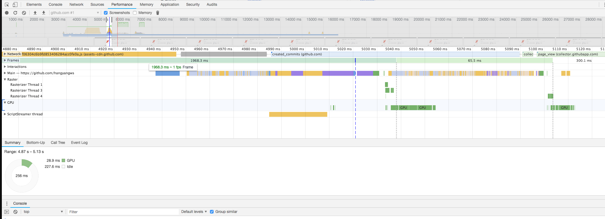

关于性能推荐文章： [前端性能优化之 Performance 神器](https://segmentfault.com/a/1190000009845281)

- 总结

devTools 就是一片大海，等着你去航行。短篇幅的入门介绍文章不能全部解读，推荐一篇目录全面，描述详细的好文：[Chrome 开发者工具中文文档](http://www.css88.com/doc/chrome-devtools/) 

## Git 代码管理

代码管理可是十分的重要，还记得在很久以前使用 SVN，相比后来使用 Git，简直就是解放。  
与 SVN 相比，Git 具有分布式的特点，使用更灵活，分支轻量化，速度更快，仓库文件尺寸也较小。  

在介绍 Git 前，我们得搞清楚 Git 是什么。  
Git 是一个开源的分布式版本控制系统，可以有效、高速的处理从很小到大小项目的版本管理。  
Git 是由 Linus 缔造者「Linus Torvalds」为了帮助管理 Linux 内核开发而研发的一个开放源码的版本控制软件。  
简单来说，Git 就是一个高级的代码历史管理工具，可以手动给代码打标记、记录版本、回滚版本、合并别人的版本……

这里描述几个平时遇到的业务场景：

1. 修改了两个文件，但是只需要上线其中一个文件的功能，这个时候怎么办？
2. 两个人在同时维护一个项目，怎么同步对方的代码？
3. 想看看当前修改代码和上一个版本的区别？
4. 想回到上一个版本的代码？
5. 想看看当前项目的文件状态，修改了哪些文件？
6. 同时开发两个功能，怎样让代码不混在一起？
7. 一不小心删了代码，不知道怎么退回去？
8. ……

我相信，如果没有 Git，上面这些问题，真的就是问题了。非常感谢 Linus 大神创造了这么优秀的软件。  
记得在很久很久以前，我见过复制整个项目文件来做版本管理，现在想想真是令人窒息的操作。  
可能大家对于版本控制还处于模糊的概念，  
简单的解释就是，版本控制是一种记录一个或若干文件内容变化，以便将来查阅特定版本修订情况的系统。  
版本控制不区分文件类型，除了 JS、CSS 文件以外图片等任何类型的文件都可以进行版本控制。

Git 的资源有三种状态：已修改「modified」、已暂存「staged」、已提交「committed」。  
已修改表示修改了文件，但还没保存到数据库中；  
已暂存表示对一个已修改文件的当前版本做了标记，使之包含在下次提交的快照中；  
已提交表示数据已经安全的保存在本地数据库中。  

可以通过「git status」命令查看项目状态。  
我们可以把本地的 Git 项目分成三个区域概念：工作文件区域、已暂存区域、Git 仓库。  
结合远端仓库，我们平时的操作流程图大致如下。

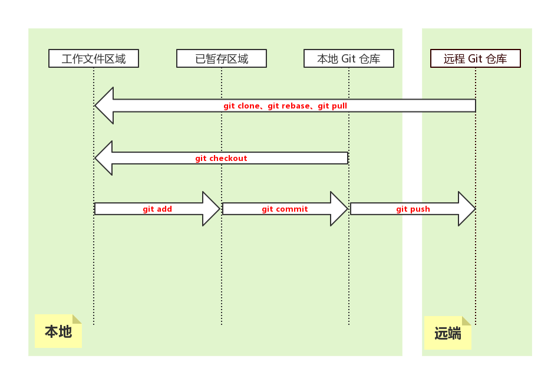

Git 是以命令行为基础的软件，但是市面上有这种各样的 GUI 工具，包括狠多 IDE 默认支持 Git 图形界面。  
建议初次使用者以命令行上手，会让你更快更深的理解 Git，因为很多 GUI 为了降低操作难度，只实现了 Git 部分常用命令。  
我们可以选择使用 GUI，但是不能不会命令行。

安装 Git 后应该配置一下用户名和邮箱：  
`git config user.name 'Name'` 修改当前项目用户信息。  
`git config user.email 'Name@xx.com'` 修改当前项目的邮箱信息。  

还有 Git 默认对大小写文件不敏感，需要配置一下：  
`git config core.ignorecase false` 让 git 对文件大小写敏感。

在安装、配置好 Git 后，可以选择以 Github 项目作为 Git 实验田。  
首先第一个使用的命令就是「git clone」。  
`git clone <url> [FolderName]`：检出代码到本地；FolderName 为自定义文件夹名，如果不写则默认以项目名新建文件夹。  

克隆项目到本地后，默认在 master 分支。  
比如现在需要开发「登录功能」，首先 checkout 一个新的分支：login。  
`git checkout login` 适用于切换到已经存在的分支，比如切换到 master 分支；  
`git checkout -b login` 先创建分支，再切换到该分支，适用于开发新功能的时候使用。  

在新的 login 分支上，我们开始开发，新建、修改文件等一些列操作。  
在开发过程中通过 `git status` 查看文件的状态。  
功能开发好了后通过 `git add` 把相关文件添加到暂存区，然后 `git commit -m '登录功能'` 添加缓冲区文件到「已提交区」记录文件快照。  
建议每次 git commit 操作的时候都带上简要的消息。

可能还有其他同事一起开发，我们需要同步他们的代码，在代码合并的时候也许会遇到代码冲突。  
代码冲突是指多人同时修改同一个文件同一个地方，Git 会不知道使用哪个版本，这个会交给开发者自己解决。  
首先获取新的代码，方式大致有 2 种：git pull、git rebase。  
这里介绍 git rebase。关于 pull 与 rebase 的区别，这里不深入讨论。  
同步远端分支的代码一般流程：
1. `git fetch` // 获取远端最新的代码
2. `git rebase origin/branchName` // 合并 branchName 分支的代码

如果有代码冲突：
1. `解决冲突` // 把冲突的代码改好
2. `git add .` // 添加相应的修改文件
3. `git rebase --continue` // 代码合并继续，冲突解决完成

在合并同事的代码后，我们通过 `git push origin login:login -f` 命令把本地 login 分支推送到远端 login 分支。  
「-f」代表强制推送，一般不推荐使用，当通过 rebase 解决冲突后，一定带上「-f」才能推送成功。

在开发过程中，我们可以通过 `git diff` 查看已修改的详细内容。  
注意：在 diff 界面，通过快捷键「q」退出。

如果发现 git commit 的提交信息不正确，还可以通过 `git commit --amend` 命令修改。  
通过 `git log` 命令显示你是提交记录。

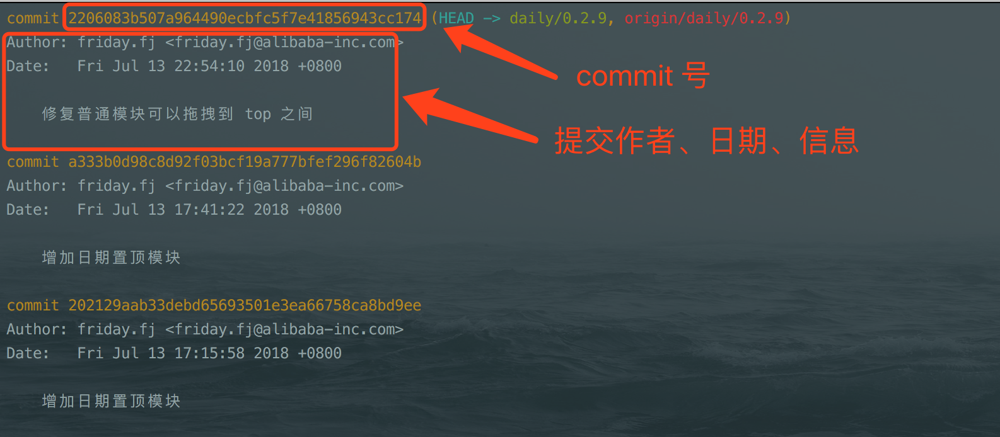

如果想回到某次提交的代码，可以通过 `git reset` 命令。
例如：
1. `git reset --hard HEAD~3` 表示回退到 3 次 commit 前的代码。
2. `git reset --soft 495f7482730bcc110308faa1258432ef5cef8cda`表示固定回到某一次提交，后面的 hash 值可以通过「git log」查看。

当我们的分支上线后，可能就不会再使用这个分支，可以通过 `git push origin :branchName` 删除远端分支。  
通过 `git branch -D branchName` 删除本地分支。

Git 十分强大，使用场景不仅仅局限于上面提到的，我们在平时开发合作中会遇到各种各样的需求场景。  
比如合并分支，强制以线上代码合并等等。  
Git 的很多命令以及参数需要我们自己去探索，多看文档，多实践。

最后推荐一片完善的详细的 Git 教程：[Git Book](https://git-scm.com/book/zh/v2)

## 其他

### 编辑器与 IDE

作为一个 coder，编辑器是基础工具，是必须得熟练掌握的，因为它将陪伴你很多年。
编辑器相比 IDE 的优点是：界面简洁，安装包小，启动快速，轻便灵活，可扩展；  
缺点也随之而来，由于快速，体积小，往往不支持编程语言的识别，不包含调试、编辑等。  
比较常见编辑器有 Sublime Text、Emacs、Vim、Atom…  

比如 Sublime 界面简单，单纯是个文本编辑器，从某种层面上看和 windows 的记事本无差异。  
但是 Sublime 支持各种快捷键、多行编辑、正则多文件搜索、goto anything、Snippets 代码片段、图片预览、自定义配置、丰富的插件……  
在熟练使用过后，会成为开发利器，爱不释手。  
Atom 和 Sublime 大部分类似，Atom 界面是本地 HTMl 渲染，性能相比 Sublime 差一些。  

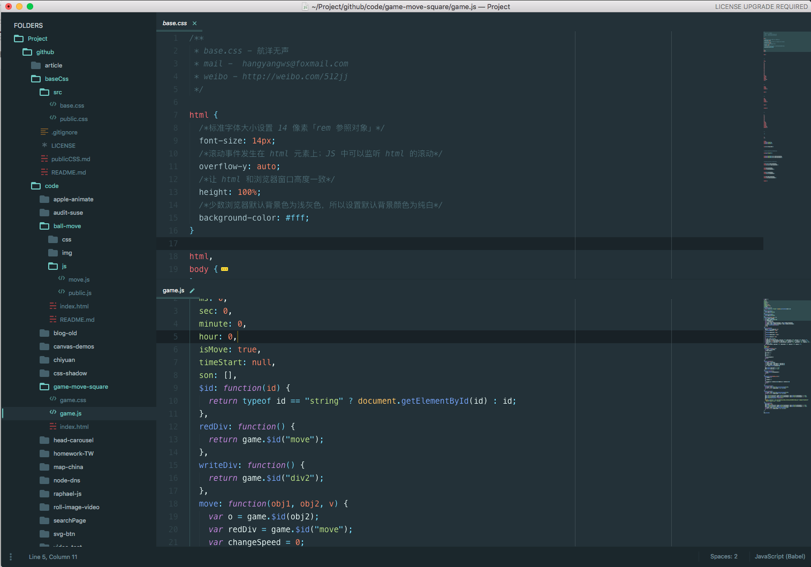

有不少 coder 极客偏爱 Emacs、Vim，前段时间看到一个段子：  
Q：如何得到一个标准的随机字符串？A：让新手退出 Vim。  
从这个段子可以看出，Vim 好像很难上手的样子，不过 Vim 也有自己迷人的地方：  
历史悠久、高逼格「可忽略」、跨平台、Mac，Unix，Linux 自带……  
Emacs 相比 Vim 用户量会少很多，但是却强大狠多，如果有兴趣可以尝试。  
编辑器最重要的是自己喜欢，习惯，适应，熟悉，切记盲从跟风。  

和编辑往往一起被谈及的是 IDE「Integrated Development Environment - 集成开发环境」。  
IED 从名字就能看出来，不仅仅只有编辑功能，而是一个集成环境。  
IDE 就像一个成熟的工厂，不仅仅能编辑代码，甚至可以代码运行、断点，有些 IDE 还集合了相应开发语言的 SDK。  
在 IDE 中，开发者可以根据自己的开发语言、喜好安装相应的插件，帮助自己更好的运行、调试。  
市面上常见的 IDE 有：JBuilder、Eclipse「市场份额持续下滑」、Intellij IDEA、Visual Studio Code……  
在前端，见过做多的是 VSCode、其次是 IDEA。  
而且碰巧，我见使用 IDEA 的前端工程师们大多安装了 Vim 插件。不过 IDEA 的 Web 版目前是收费的。  
这里谈一谈 VSCode，更友好的 UI 支持，自带 Git 管理、调试工具、扩展程序管理……  

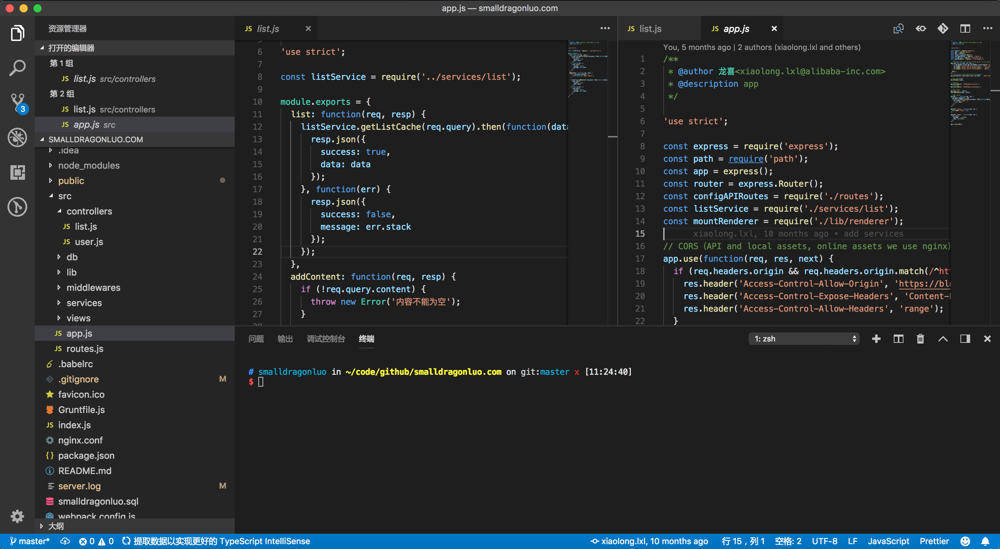

如果编辑器不能满足自己的日常需求，可以考虑进军 IDE，你会发现另一片新天地。

### 切图

切图可不是像名字一样，看起来那么简单。  
首先我们得知道我们需要什么样的图，尺寸多大，是否有透明背景，需要什么格式，什么格式最合适……  

一般情况下，小图标、有透明背景的图片统一切图为 png 格式。  
如果图片颜色要求不高，且颜色单一的图可以考虑切图为 png8，因为 png8 的文件大小会小很多。  

png8：  
最多只能展示 256 种颜色，所以 png8 格式更适合颜色比较单一的图像。  
例如纯色、logo、图标等，因为颜色数量少，所以图片的体积也会更小。

png24：  
可展示的颜色就远远多于 png8，最多可展示的颜色数量多达 1600 万；  
所以 png24 所展示的图片颜色会更丰富，图片的清晰度也会更好，图片质量更高，当然图片的大小也会相应增加，  
所以 png24 的图片比较适合像摄影作品之类颜色比较丰富的图片；

如果图片没有透明像素，且尺寸较大，考虑切图为 jpg 格式。  
jpg 相对于 png 没有透明通道，文件体积会小很多。

在 PS 里，快捷键 `cmd + shift + alt + S` 是图片保存为 web 版格式，且有各种存储选项可供挑选。

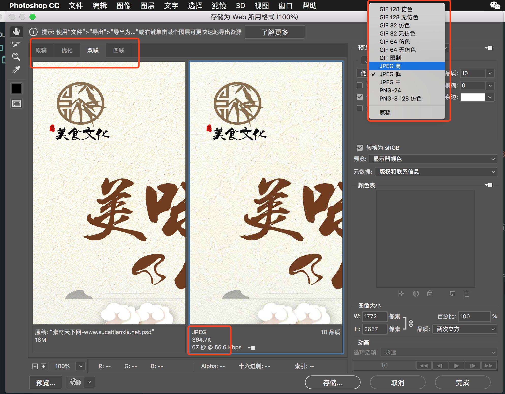

首先我们讲讲 PS 切图，如下图需要把一盘小龙虾和盘子阴影切下来，用于 Web 图片。

但是我们发现盘子和阴影是 2 个图层。

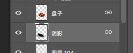

这个时候我们可以按住 cmd 键，鼠标依次点击 2 个图层，选中后 `cmd + G` 快捷键把 2 个图层合并为一个组。  
然后再右键新的分组，选择「快速导出 png」就可以得到我们需要的 2 个合并后的图层了，并且是透明背景的 png。

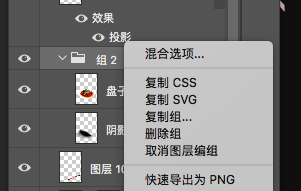

另外 PS 的切图工具也是切图不错的选择。

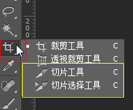

用「切片工具」选择好要切的区域后，在导出 Web 格式的时候，会自动选择切图模式：

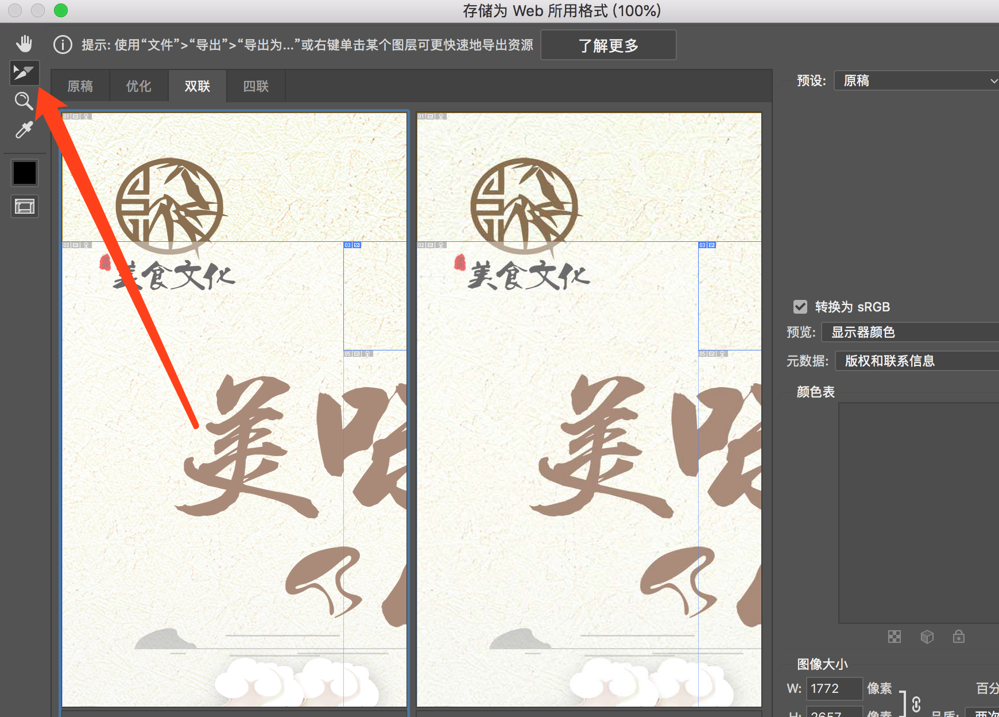

现在 UI 设计师都不怎么用 PS 设计，好像喜欢 PS 都是喜欢玩摄影的大佬。  
UI 设计师纷纷使用 sketch 设计视觉稿，所以我们还得学会 sketch 切图才行呀。

sketch 和 PS 类似，都有层叠的概念。在选中某个层，或者某个组后，在软件右下角有个「Make Exportable」按钮。  
sketch 支持转换切图倍数，切图格式。

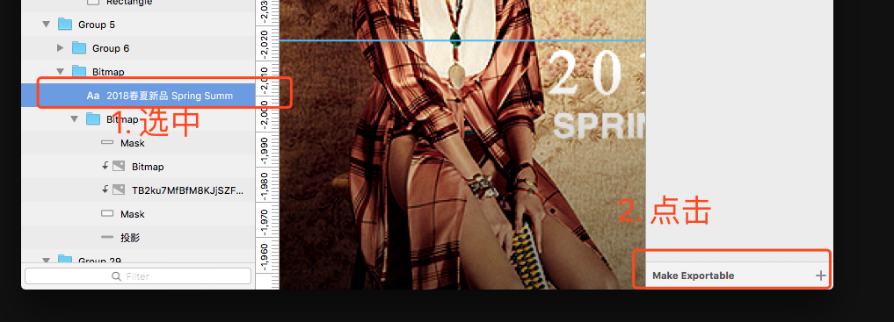
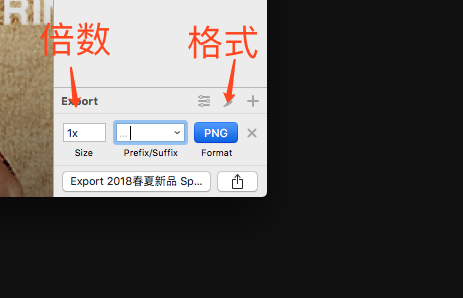

### Charles 网络代理、抓包

Charles 是作为「代理服务器」来完成封包截取的，在使用 Charles 的第一步是将其设置成系统的代理服务器。

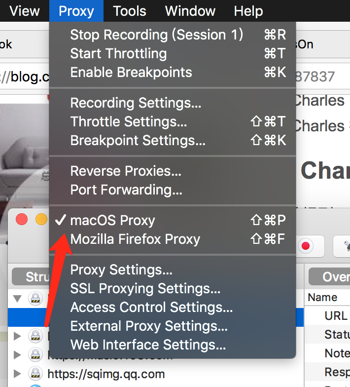

Charles 是作为代理服务器来运作的，默认情况下是不能拦截浏览器的 http 请求的，需要在浏览器上设置代理到 Charles 上。  
这里推荐一款 Chrome 插件：SwitchyOmega「一个代理设置工具」。

比如我们现在有个需求：在线上环境调试 JS 代码。通过 Charles 代理把线上环境的 JS 文件请求替换为本地的 JS 资源。
首先查看 Charles http 端口：

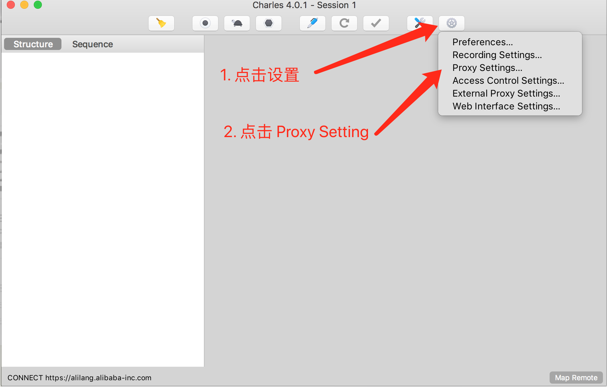
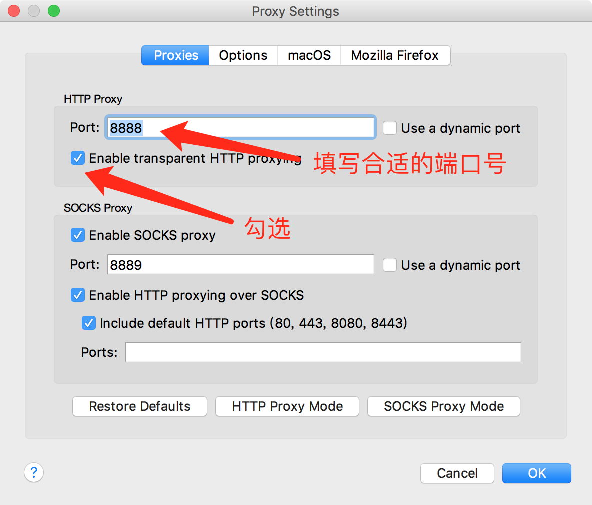

然后在 Chrome 中使用 SwitchyOmega 设置代理到 Charles 上。

再设置 Map Remote，指定代理的请求：
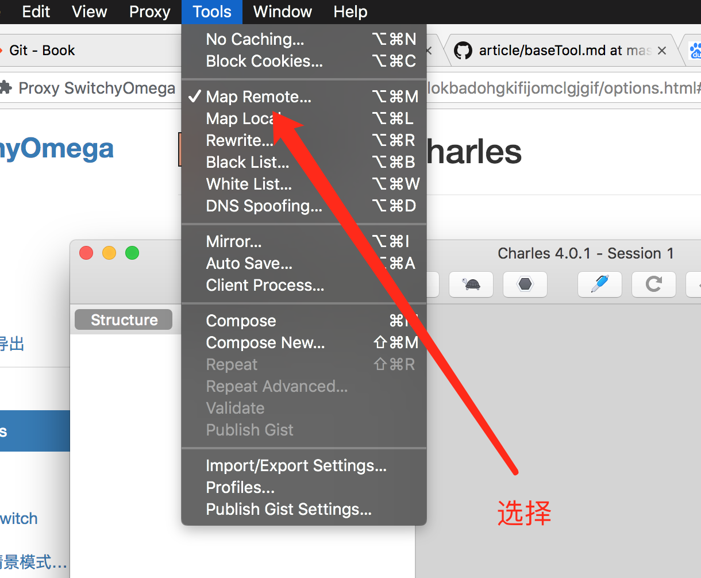
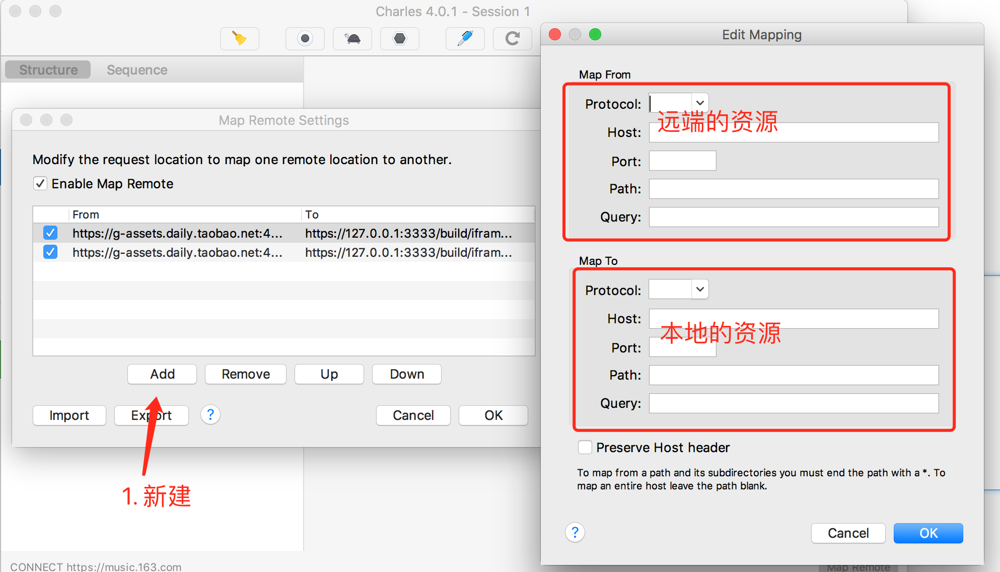

这个时候就完成了资源代理设置，刷新浏览器，在 devTools 版本中看到的相应的 http 请求就是经过 Charles 代理后的。

Charles 抓包原理一样。在设置好代理后，打开 Recoring 功能：

抓包一般常用与手机端，因为 PC 端 devTools 可以做到相似的功能。  
在手机端一样需要设置代理，且保持手机 Wi-Fi 和电脑处于相同的局域网。
